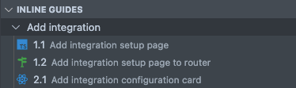

# Inline guides

Navigate your codebase with guides.



## Usage

Add guides throughout your codebase by adding comments in this format: `@guide [name] - [step] [description]`.

```ts
// @guide Add integration - 1.1 Add integration setup page
...

// @guide Add integration - 1.2 Add integration setup page route
...

// @guide Add integration - 2.1 Add integration configuration card
...
```

If this sounds tedious, try the `guide` snippet!

## License

MIT © Dado HR
